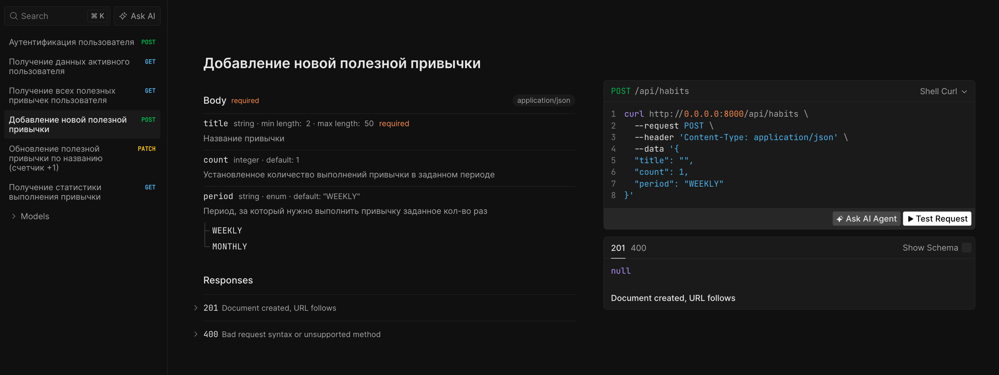

## Prereq
- Python 3.11
- Docker/docker compose (v2)

## Envs
- prod
- dev
- test

## Клонирование репозитория

```
git clone git@github.com:darialissi/litestar-habittracker.git && cd litestar-habittracker
```

## Сборка и запуск приложения и его зависимостей [prod]

```
docker compose --profile prod up
```

#
Документация доступна на <http://127.0.0.1:8000/docs>



## Локальная конфигурация и запуск приложения [dev]

0. На основе **.env.example** создать **.env** в корне проекта
1. Запустить через оболочку **dev.sh** (при необходимости сделать файл исполняемым: `chmod +x dev.sh`)

## Тестирование [test]

### Unit

```
pytest tests/unit
```

### Integration

```
pytest tests/integration
```

### E2E

```
# Поднимаем тестовую БД
docker compose --profile test up -d
```

```
pytest tests/e2e
```