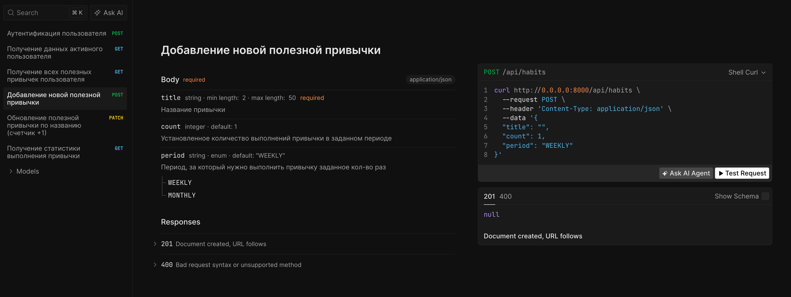

# Habit Tracker API

🛰 REST API

🛰 JWT-based authentication

🛰 MCP server with stdio transport

#

🌋 Litestar, FastMCP, SQLAlchemy-advanced, Alembic, Pydantic, Pytest

## Prereq
- Python 3.11
- Docker/docker compose (v2)

## Envs
- prod
- dev
- test

## Клонирование репозитория

```
git clone git@github.com:darialissi/litestar-habittracker.git && cd litestar-habittracker
```

## Сборка и запуск приложения и его зависимостей [prod]

```
docker compose --profile prod up
```

#
Интерактивная документация доступна на <http://127.0.0.1:8000/docs>



## Локальная конфигурация и запуск приложения [dev]

0. На основе **.env.example** создать **.env** в корне проекта
1. Запустить через оболочку **dev.sh** (при необходимости сделать файл исполняемым: `chmod +x dev.sh`)

## Тестирование [test]

### Unit

```
pytest -m unit
```

### Integration

```
pytest -m integration
```

```
# just validation without DB
pytest -m validation
```

### E2E (+ load)

```
# Поднимаем тестовую БД
docker compose --profile test up -d
```

```
pytest -m e2e
```

```
pytest -s -m load
```

## MCP configuration

Токен можно получить через GET `/api/account/token`

```
  "mcpServers": {
    "mcp-habittracker": {
      "command": "/Users/lissi/Projects/litestar-habittracker/.venv/bin/python3",
      "args": [
        "/Users/lissi/Projects/litestar-habittracker/src/app_mcp.py"
      ],
      "env": {
        "MCP_AUTH_TOKEN": "eyJhbGciOiJIUzI1NiIsInR5cCI6IkpXVCJ9..."
      }
    }
  }
```

Примеры промптов

```
Выполни анализ моих привычек за последние 10 дней.
```

Системные промпты (удобнее использовать через интерфейс клиента)

```
# с указанием кол-ва дней для анализа
habits_analysis 5 дней
```

```
weekly_review
```